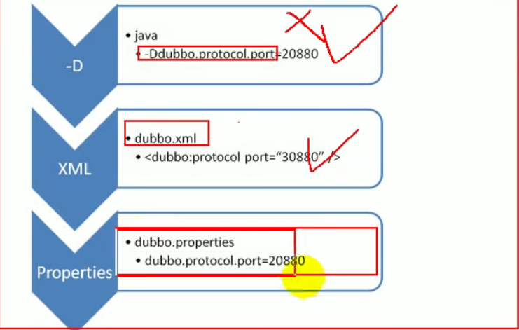

# dubbo

## 一、基础

### 1.1 dubbo.properties

#### 1.1.1 配置文件优先级



命令行->springXML配置->dubbo.properties

#### 1.1.2 配置生效规则

+ 默认1000ms
+ 超时属性配置优先规则
  + 精确优先  方法>服务>应用（全局配置）
  + 如果级别一样则 消费>生产

#### 1.1.3重试次数

+ 默认重试次数为3
+ 接口幂等性就是用户对同一操作发起了一次或多次请求的对数据的影响是一致不变的，不会因为多次的请求而产生副作用。

#### 1.1.4 使用version配置可以实现灰度发布

#### 1.1.5 本地存根

+ 可以使用本地存根进行一些提前的验证

```java

/**
 * 消费者端本地存根，使用有参构造器
 * @author lee
 */
public class UserServiceStub implements UserService {

    private UserService userService;

    public UserServiceStub(UserService userService) {
        this.userService = userService;
    }

    public String sayHello(String name) {
        if (name == null) {
            return "hello 无名";
        }

        return userService.sayHello(name);
    }

}


```

```xml
<dubbo:reference id="userService" check="false" interface="com.dubbo.service.UserService" stub="com.dubbo.consumer.stub.UserServiceStub"/>
```


#### 1.1.6 与springboot进行整合

+ 导入dubbo-starter，在application.properties配置属性，使用@service暴露服务

+ 保留dubbo.xml配置文件，使用@ImportResource进行导入

+ 将组件写入到容器中，然后使用@enableDubbo来扫描对应组件

  ```java
  public class ProviderConfig {
  
  
      @Bean
      ApplicationConfig applicationConfig() {
          ApplicationConfig applicationConfig = new ApplicationConfig();
          applicationConfig.setName("application-provider");
          return applicationConfig;
      }
  
      @Bean
      RegistryConfig registryConfig() {
          RegistryConfig registryConfig = new RegistryConfig();
          registryConfig.setAddress("127.0.0.1:2181");
          registryConfig.setProtocol("zookeeper");
          return registryConfig;
      }
  
      @Bean
      ProtocolConfig protocolConfig() {
          ProtocolConfig protocolConfig = new ProtocolConfig();
          protocolConfig.setHost("20880");
          protocolConfig.setName("dubbo");
          return protocolConfig;
      }
  
      @Bean
      ServiceConfig<UserService> serviceConfig(UserService userService) {
          ServiceConfig<UserService> serviceConfig = new ServiceConfig<UserService>();
          serviceConfig.setInterface(UserService.class);
          serviceConfig.setRef(userService);
  
          // 配置method
          MethodConfig methodConfig = new MethodConfig();
          methodConfig.setName("sayHello");
  
          // 将method设置到serviceConfig中
          serviceConfig.setMethods(Arrays.asList(methodConfig));
          return serviceConfig;
      }
  }
  ```


#### 1.1.7 高可用

+ zookeeper宕机注册中心宕机，消费者仍然可以调用服务者，可以使用本地缓存进行通讯

#### 1.1.8 负载均衡机制

+ random 随机+权重设置概率
+ roundRobin 按照权重的轮训
+ leastActive 最近最少活跃
+ ConsistentHash 一致性hash


#### 1.1.9 服务降级

当服务器压力剧增，根据业务情况及流量，对一些服务和页面有策略的不处理或者换中简单方式处理，从而释放服务器资源以保证核心交易正常运作

两种降级策略可选

+ mock=force:return+null， 表示消费者对该服务发起的调用直接返回null，不发起远程调用
+ mock=fail:return+null 表示调用失败后返回null，不抛异常，避免不重要服务不稳定对调用方的影响


#### 1.1.10 集群容错

+ failOverCluster  出现失败重试其他服务器，重试会带来延迟，可以使用retries="2"来限定重试次数

+ failFastCluster  只发起一次调用，，出现异常直接忽略，通常使用与写入日志类操作

+ failBackCluster  失败后台记录日志，定时重发，用于消息通知类的必须成功的操作

+ forkingCluster  并行调用多个服务器，只要有一个调用成功直接返回，并行调用会浪费资源，可以使用forks=2来限定并行数

+ broadCastCluster 广播，调用所有服务，任意一台失败及报错，通常适用于通知所有提供者更新缓存和日志等本地资源操作

  

### 二、dubbo原理

#### 2.1.1 RPC原理

##### 2.1.1.1 消费者以本地调用方式调用服务

+ 客户端client stub接收到调用请求后，负责将方法参数等组装成能够在网络传输的消息体
+ 客户端client stub找到服务地址，并将消息发送到服务端
+ sever stub 将消息进行解码
+ sever stub 根据解码结果调用本地服务
+ 本地服务执行，将结果返回给sever stub
+ sever stub 将返回结果打包称消息返回给消费方
+ client stub 解码得到最终的结果

##### 2.1.1.2 netty通信原理

+ BIO(Blocking IO)阻塞式IO

  


+ NIO(NOT Blocking IO) 非阻塞式IO


#### 2.1.2 dubbo原理

##### 2.1.2.1 框架设计

+ Business层
  + Service 业务逻辑层，编程者关注的一层，面向接口变成即可，

+ RPC层
  + Config层：配置层，封装配置文件中解析出来的信息
  + Proxy：服务代理层，生成代理对象
  + Registry：注册中心层，用于注册和发现服务
  + Cluster：负载均衡，服务调用
  + monitor：服务监控
  + protocol：远程调用层，封装了远程调用
+ remoting层
  + exchange：信息交换层，两个端架起管道互相通信
  + transport：封装netty，传输数据
  + serialize：序列化层，序列化与反序列化

##### 2.1.2.2 启动解析，加载配置文件

+ ```java
  // 1.spring容器启动获取一个容器
  ConfigurableListableBeanFactory beanFactory = obtainFreshBeanFactory();
  
  // 2.加载配置文件,获取所有配置文件，读取流然后通过DOM解析，解析成Element对象，
  refreshBeanFactory(); 
  loadBeanDefinitions(beanFactory);
  	protected void loadBeanDefinitions(DefaultListableBeanFactory beanFactory) throws BeansException, IOException {
  		// Create a new XmlBeanDefinitionReader for the given BeanFactory.
  		XmlBeanDefinitionReader beanDefinitionReader = new XmlBeanDefinitionReader(beanFactory);
  
  		// Configure the bean definition reader with this context's
  		// resource loading environment.
  		beanDefinitionReader.setEnvironment(this.getEnvironment());
  		beanDefinitionReader.setResourceLoader(this);
  		beanDefinitionReader.setEntityResolver(new ResourceEntityResolver(this));
  
  		// Allow a subclass to provide custom initialization of the reader,
  		// then proceed with actually loading the bean definitions.
  		initBeanDefinitionReader(beanDefinitionReader);
  		loadBeanDefinitions(beanDefinitionReader);
  	}
  
  
  // 3.解析非spring（这里就是指dubbo）的配置
  if (delegate.isDefaultNamespace(root)) {
  			NodeList nl = root.getChildNodes();
  			for (int i = 0; i < nl.getLength(); i++) {
  				Node node = nl.item(i);
  				if (node instanceof Element) {
  					Element ele = (Element) node;
  					if (delegate.isDefaultNamespace(ele)) {
  						parseDefaultElement(ele, delegate);
  					}
  					else {
  						delegate.parseCustomElement(ele);
  					}
  				}
  			}
  		}
  		else {
  			delegate.parseCustomElement(root);
  		}
  
  // 4.注册dubbo的配置文件解析器DubboNamespaceHandler，根据不同的标签有不同的解析方式
  public void init() {
          registerBeanDefinitionParser("application", new DubboBeanDefinitionParser(ApplicationConfig.class, true));
          registerBeanDefinitionParser("module", new DubboBeanDefinitionParser(ModuleConfig.class, true));
          registerBeanDefinitionParser("registry", new DubboBeanDefinitionParser(RegistryConfig.class, true));
          registerBeanDefinitionParser("monitor", new DubboBeanDefinitionParser(MonitorConfig.class, true));
          registerBeanDefinitionParser("provider", new DubboBeanDefinitionParser(ProviderConfig.class, true));
          registerBeanDefinitionParser("consumer", new DubboBeanDefinitionParser(ConsumerConfig.class, true));
          registerBeanDefinitionParser("protocol", new DubboBeanDefinitionParser(ProtocolConfig.class, true));
          registerBeanDefinitionParser("service", new DubboBeanDefinitionParser(ServiceBean.class, true));
          registerBeanDefinitionParser("reference", new DubboBeanDefinitionParser(ReferenceBean.class, false));
          registerBeanDefinitionParser("annotation", new DubboBeanDefinitionParser(AnnotationBean.class, true));
      }
  
  // 使用DubboBeanDefinitionParser.parse进行解析
  // 创建XXXConfig对象并将属性赋值
  if (ProtocolConfig.class.equals(beanClass)) {
              for (String name : parserContext.getRegistry().getBeanDefinitionNames()) {
                  BeanDefinition definition = parserContext.getRegistry().getBeanDefinition(name);
                  PropertyValue property = definition.getPropertyValues().getPropertyValue("protocol");
                  if (property != null) {
                      Object value = property.getValue();
                      if (value instanceof ProtocolConfig && id.equals(((ProtocolConfig) value).getName())) {
                          definition.getPropertyValues().addPropertyValue("protocol", new RuntimeBeanReference(id));
                      }
                  }
              }
          }
  
  ```

##### 2.1.2.3 服务暴露

前提：dubbo加载配置文件将配置文件解析封装成对应的xxxConfig对象


将service标签解析成ServiceBean对象，将reference标签解析成ReferenceBean对象

```java
public class ServiceBean<T> extends ServiceConfig<T> implements InitializingBean, DisposableBean, ApplicationContextAware, ApplicationListener<ContextRefreshedEvent>, BeanNameAware {}
// 1.ServiceBean实现了InitializingBean和ApplicationListener<ContextRefreshedEvent>两个接口，分别在ServiceBean加载后和容器刷新后回调


```


第一步，前置工作，检查参数

+ 检测 <dubbo:service> 标签的 interface 属性合法性，不合法则抛出异常
+ 检测 ProviderConfig、ApplicationConfig 等核心配置类对象是否为空，若为空，则尝试从其他配置类对象中获取相应的实例。
+ 检测并处理泛化服务和普通服务类
+ 检测本地存根配置，并进行相应的处理
+ 对 ApplicationConfig、RegistryConfig 等配置类进行检测，为空则尝试创建，若无法创建则抛出异常

第二步，导出服务，导出服务到远程，导出服务到本地

+ ServiceBean对象实现了InitializingBean和ApplicationListener方法，在对象初始化完成后，和容器刷新后都会调用导出方法，

  容器启动完成后会发布刷新事件

  


+ ```xml
  <dubbo:provider export="false" />
  <!--->这个方法标注了该服务是否需要导出
  ```

+ 

+ 

+ 


第三步，向注册中心注册服务


##### 2.1.2.4 服务引用

##### 2.1.2.5 服务调用
