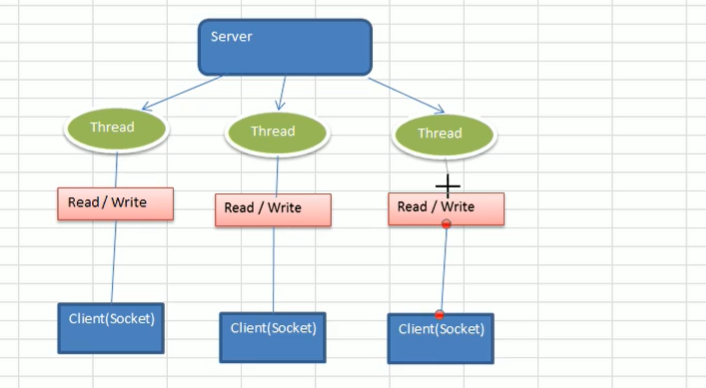

## netty

### 一、netty的介绍

### 1.1 netty介绍

+ 异步的、基于事件驱动的网络应用框架
+ 基于TCP协议，面向Clients端的高并发应用，
+ 本质是NIO框架，非阻塞式IO

### 1.2 BIO和NIO

+ BIO

  一个线程对应一个连接，客户端一个请求就需要一个线程进行处理，当连接不用的时候会造成不必要线程开销

  

  编程模型：

  	+  服务器端启动一个SeverSocket，
  	+  客户端启动Socket，对服务器进行通信，默认情况下，服务器端需要对每个连接启动线程进行通信
  	+  客户端发送请求后，先咨询服务器是否有线程相应，如果没有，则等待或者拒绝，
  	+  客户端等待响应（等待过程中有阻塞）

  

+ NIO

  服务器一个线程可以处理多个请求，客户端发送的连接请求都会注册到多路复用器上，多路复用器轮训到连接IO进行处理

  

   

+ AIO  异步非阻塞

#### 1.2.1 NIO和BIO进行比较

+ BIO是流数据处理，NIO是块数据处理（以基本类型为块单位，Buffer）块数据处理方式比流处理方式快
+ BIO是阻塞的，NIO非阻塞
+ BIO基于字符流和字节流，NIO基于Channel、Buffer 数据总是从管道读取到缓冲区中，或者从缓冲区写入到管道中，Selctor选择器监听多个通道事件，一个线程可以监听多个客户端通道
+ 

### 1.3 BIO编程实例

```java
package com.netty.bio;

import com.sun.org.apache.xpath.internal.WhitespaceStrippingElementMatcher;

import javax.smartcardio.TerminalFactory;
import java.beans.beancontext.BeanContext;
import java.io.IOException;
import java.io.InputStream;
import java.net.ServerSocket;
import java.net.Socket;
import java.util.Scanner;
import java.util.concurrent.ExecutorService;
import java.util.concurrent.Executors;

public class BIOServer {
    public static void main(String[] args) throws IOException {
        // 创建线程池
        ExecutorService executorService = Executors.newCachedThreadPool();

        //
        ServerSocket serverSocket = new ServerSocket(6666);
        System.out.println("服务器启动了");

        while (true) {
            // 等待链接
            System.out.println("等待链接。。。。。。");
            Socket socket = serverSocket.accept(); // 此处会进行阻塞
            System.out.println("链接到一个客户端");

            executorService.execute(() -> {
                // 和客户端进行通信
                try {
                    handler(socket);
                } catch (IOException e) {
                    e.printStackTrace();
                }
            });
        }
    }

    public static void handler(Socket socket) throws IOException {

        System.out.println("当前线程名称：" + Thread.currentThread().getName() + "ID:" + Thread.currentThread().getId());
        byte[] bytes = new byte[1024];
        // 获取流
        InputStream inputStream = socket.getInputStream();


        System.out.println("等待客户端发送消息。。。。。。");
        // 循环读取
        while (true) {
            int read = inputStream.read(bytes); // 流的读取会进行阻塞，如果没有数据的情况下
            if (read != -1) {
                System.out.println(new String(bytes, 0, read));
            } else {
                break;
            }
        }

    }
}
```

### 1.4 NIO 实例

NIO 三大核心组件：

+ Chnnel(通道)、Buffer(缓冲区)、Selector(选择器)

#### 1.4.1 Buffer实例

```java
// 穿创建一个Buffer，可以装5个int类型的值
IntBuffer intBuffer = IntBuffer.allocate(5);
for (int i = 0; i < intBuffer.capacity(); i++) {
    // 写入Buffer
    intBuffer.put(i * 2);
}
// 读写翻转
intBuffer.flip();

while (intBuffer.hasRemaining()) {
    System.out.println(intBuffer.get());
}
```

#### 1.4.2 NIO三大组件的关系

+ 每个Channel都对应一个Buffer
+ 一个Selector对应一个线程，一个线程对应多个Channel（连接）
+ 该图表示了有三个Channel注册到Selector
+ Selector处于监听状态，切换到哪个channel是由事件决定的，根据不同事件，在各个通道上切换
+ Buffer就是一个内存块，底层就是一个数组
+ BIO只能是输入流或者输出流，Buffer可以读也可以写，需要使用flip()进行切换


#### 1.4.3 Buffer详细讲解

```java
    // 标记，暂时看没啥意思
	private int mark = -1;
	// 下一个要被读或者写元素的索引
    private int position = 0;
	// 当前缓冲区的终点
    private int limit;
	// 缓冲区容量，不可改变，创建的时候指定好的
    private int capacity;

public final boolean hasRemaining() {
        return position < limit;
}

// 清除缓冲区，将各个指标恢复初始状态，并未清除数据
public final Buffer clear() {
        position = 0;
        limit = capacity;
        mark = -1;
        return this;
}


```

#### 1.4.4 Channel

+ 通道可以同时进行读写，流只能读写
+ 通道可以实现异步读写数据
+ 通道可以从缓冲区读数据，也可以写到缓冲区中

##### 1.4.4.1 主要实现类

+ SocketChannel(UDP读写)、ServerSocketChennel(UPD读写)、

+ FileChannel（文件读写）

+ DatagramChannel （TCP读写）

  可以通过ServerSocketChannel（相当于BIO中的ServerSocket）创建一个SocketChannel（相当于BIO中Socket）

##### 1.4.4.2 通过channel将字符写入到本地文件中

```java
String text = "hello 尚硅谷";
// 创建输出流->包装到fileChannel
FileOutputStream fileOutputStream = new FileOutputStream("d://a.txt");
// 创建Channel
FileChannel channel = fileOutputStream.getChannel();
// 创建一个缓冲
ByteBuffer buffer = ByteBuffer.allocate(1024);
// 将字符写入到buffer
buffer.put(text.getBytes());
// 对buffer进行翻转
buffer.flip();
// 写入到Channel
channel.write(buffer);
// 关闭流
fileOutputStream.close();
```

##### 1.4.4.3 通过channel读取本地文件

```java
// 创建文件输入流
FileInputStream inputStream = new FileInputStream("D://a.txt");
// 创建通道
FileChannel fileChannel = inputStream.getChannel();
// 创建缓冲区
ByteBuffer byteBuffer = ByteBuffer.allocate(1024);
// 从通道中读数据
fileChannel.read(byteBuffer);
byteBuffer.flip();
// 显示缓冲区中的数据
System.out.println(new String(byteBuffer.array()));
```

##### 1.4.4.4 使用一个Buffer完成文件读取

```java
File file = new File("1.txt");
FileInputStream fileInputStream = new FileInputStream(file);

FileOutputStream fileOutputStream = new FileOutputStream("2.txt");

FileChannel fileInputStreamChannel = fileInputStream.getChannel();
FileChannel fileOutputStreamChannel = fileOutputStream.getChannel();
// 创建buffer
ByteBuffer byteBuffer = ByteBuffer.allocate(512);
while (true) {
    byteBuffer.clear();
    int read = fileInputStreamChannel.read(byteBuffer);
    if (read == -1) { // 表示读取完毕
        break;
    }
    // 将buffer中的数据写入到outChannel中
    byteBuffer.flip();
    fileOutputStreamChannel.write(byteBuffer);
}

fileOutputStream.close();
fileInputStream.close();
```

##### 1.4.4.5 使用FileChannel.transferTo对文件进行拷贝

```java
FileInputStream fileInputStream = new FileInputStream("1.txt");
FileOutputStream fileOutputStream = new FileOutputStream("3.txt");
FileChannel fileInputStreamChannel = fileInputStream.getChannel();
FileChannel fileOutputStreamChannel = fileOutputStream.getChannel();
fileInputStreamChannel.transferTo(0, fileInputStreamChannel.size(), fileOutputStreamChannel);
fileInputStream.close();
fileOutputStream.close();
```

##### 1.4.4.5 MappedByteBuffer，可以使用堆外内存缓冲区对象

+ 可以让文件直接在堆外内存中修改，操作系统无需拷贝一次

```java
RandomAccessFile file = new RandomAccessFile("1.txt", "rw");
FileChannel channel = file.getChannel();
/**
 * FileChannel.MapMode.READ_WRITE 读写模式
 * 0  可以直接修改的起始位置
 * 5  可以将1.txt的多少个字节映射到堆外内存，即可以修改的部分(长度大小而不是索引位置)
 */
MappedByteBuffer map = channel.map(FileChannel.MapMode.READ_WRITE, 0, 5);
map.put(0, (byte) 'H');
map.put(3, (byte) '9');
channel.close();
```

##### 1.4.4.6 分散和聚合

NIO支持通过多个Buffer进行读写操作

Scattering：写入Buffer时，可以写入Buffer数组，依次写入

Gathering：从Buffer读取时，可以采用buffer数组，一次读取

```java
ServerSocketChannel serverSocketChannel = ServerSocketChannel.open();
InetSocketAddress inetSocketAddress = new InetSocketAddress(7777);
// 绑定端口并启动
serverSocketChannel.socket().bind(inetSocketAddress);
// 创建buffer数组
ByteBuffer[] byteBufferArr = new ByteBuffer[2];
byteBufferArr[0] = ByteBuffer.allocate(5);
byteBufferArr[1] = ByteBuffer.allocate(3);

// 假定从客户端接收8个字节
int messageLength = 8;

// 有客户端进行连接，则创建一个SocketChannel
SocketChannel socketChannel = serverSocketChannel.accept();
while (true) {
    int byteRead = 0;
    while (byteRead < messageLength) {
        long read = socketChannel.read(byteBufferArr);
        byteRead += read;
        System.out.println("读取到的" + byteRead);
        // 使用流打印，看看当前Buffer有什么数据
        Arrays.stream(byteBufferArr)
                .map(byteBuffer -> "position:" + byteBuffer.position() + "---->limit:" + byteBuffer.limit())
                .forEach(System.out::println);
    }

    // 将所有buffer进行翻转
    Arrays.stream(byteBufferArr).forEach(Buffer::flip);

    // 回显到客户端
    int writeByteLength = 0;
    while (writeByteLength < messageLength) {
        long write = socketChannel.write(byteBufferArr);
        writeByteLength += write;
    }

    // 复位
    Arrays.stream(byteBufferArr).forEach(Buffer::clear);
    System.out.println("byteRead = " + byteRead);
    System.out.println("writeByteLength = " + writeByteLength);
}
```

#### 1.4.2 selector

##### 1.4.2.1 介绍

用一个线程处理多个客户端连接，就会用到Selector

selector可以检测多个注册的通道上是否有事件发生，通过事件可以针对每个事件进行相应的处理

只有连接有真正读写事件发生的时候才会进行读写，大大减少了系统的开销

避免了多线程上下文切换的额外开销

##### 1.4.2.2 Selector的基本方法

selectort通过select方法(返回一个selectionkey的一个集合)监听到不同通道的事件，获取到selectionKey，通过selectionKey可有获取到channel并且区分是什么事件accept、write、read


```java
// select方法监听后，会将sectionKey加入到内部集合
// 没有事件立即返回
public abstract int selectNow() throws IOException;
// selector线程当前线程会阻塞，超时后不阻塞
public abstract int select(long timeout)
// 阻塞到监听到事件为止，至少有一个事件发生才会返回
public abstract int select() throws IOException;

// 从内部集合中得到所有selectionkey
public abstract Set<SelectionKey> selectedKeys();
```


##### 1.4.2.3 NIO模型注册过程

+ 客户端进行连接，调用SeverSocketChannel得到一个SocketChannel
+ SocketChannel可以调用register()方法注册到selector上，一个selector可以注册多个channel
+ 注册成功后返回一个sectionkey,selctor会保存与channel关联
+ selector调用select()获取到有事件发生的selectionkey集合，
+ 通过sectionkey可以获取channel进行业务处理


```java
public class NIOServer {
    public static void main(String[] args) throws IOException {
        // 创见
        ServerSocketChannel serverSocketChannel = ServerSocketChannel.open();

        // 创建一个selector
        Selector selector = Selector.open();

        // 绑定端口6666，在服务器端监听
        serverSocketChannel.socket().bind(new InetSocketAddress(6666));

        // 设置为非阻塞
        serverSocketChannel.configureBlocking(false);

        // 本身的ServerSocketChannel也要注册到Selector上去,关心事件为创建连接
        serverSocketChannel.register(selector, SelectionKey.OP_ACCEPT);

        // 循环等待客户端连接
        while (true) {
            if (selector.select(1000) == 0) {
                System.out.println("服务器等待一秒钟，无连接");
                continue;
            }

            // 如果返回的数据>0，获取到有事件发生的selectionKey集合（关注事件）
            Set<SelectionKey> selectionKeys = selector.selectedKeys();
            // 通过selectionKeys获取通道
            Iterator<SelectionKey> iterator = selectionKeys.iterator();
            while (iterator.hasNext()) {
                // 获取一个selectionKey
                SelectionKey selectionKey = iterator.next();
                // 根据key对应的通道发生的事件，
                if (selectionKey.isAcceptable()) {
                    // 此处accept方法并不会阻塞，因为已经知道他是acceptable了
                    SocketChannel accept = serverSocketChannel.accept();
                    // 设置为非阻塞
                    accept.configureBlocking(false);
                    System.out.println("客户端连接成功，生成了一个SocketChannel" + accept.hashCode());

                    // 将通道注册到selector上，并绑定一个Buffer
                    ByteBuffer byteBuffer = ByteBuffer.allocate(1024);
                    accept.register(selector, SelectionKey.OP_READ, byteBuffer);
                }

                if (selectionKey.isReadable()) {
                    // 读事件
                    SocketChannel channel = (SocketChannel)selectionKey.channel();
                    // 通过selectorKey获取到Buffer
                    ByteBuffer buffer = (ByteBuffer)selectionKey.attachment();
                    channel.read(buffer);
                    System.out.println("from 客户端" + new String(buffer.array()));

                }

                // 手动删除当前sectionKey
                iterator.remove();
            }

        }

    }
}
```

```java
public static void main(String[] args) throws IOException {
    // 得到一个网络通道
    SocketChannel socketChannel = SocketChannel.open();
    // 设置非阻塞
    socketChannel.configureBlocking(false);

    // 设置服务端IP端口
    InetSocketAddress inetSocketAddress = new InetSocketAddress("127.0.0.1", 6666);

    // 链接服务器
    if (!socketChannel.connect(inetSocketAddress)) {
        while (!socketChannel.finishConnect()) {
            System.out.println("链接需要时间，客户端非阻塞，可以做其他工作");
        }
    }

    // 如果成功链接，发送数据
    String str = "hello 尚硅谷····";
    ByteBuffer byteBuffer = ByteBuffer.wrap(str.getBytes());
    // 发送数据
    socketChannel.read(byteBuffer);
    System.in.read();
}
```

#### 1.4.3 使用NIO做一个聊天室

 

##### 1.4.3.1 服务端启动并绑定端口

##### 1.4.3.2 服务器端接收客户端消息，并实现转发，处理上线下线操作

```java
public class GroupChatServer {
    private Selector selector;
    private ServerSocketChannel listenChannel;
    private static final int PORT = 6667;

    /**
     * 初始化工作
     */
    public GroupChatServer() throws IOException {
        this.selector = Selector.open();
        this.listenChannel = ServerSocketChannel.open();
        // 绑定端口
        listenChannel.socket().bind(new InetSocketAddress(PORT));
        listenChannel.configureBlocking(false);
        // 注册
        listenChannel.register(selector, SelectionKey.OP_ACCEPT);
    }

    public void listen() {
        try {
            // 循环监听
            while (true) {
                int selectedCount = selector.select(2000);
                if (selectedCount > 0) {
                    // 有事件，进行处理
                    Iterator<SelectionKey> iterator = selector.selectedKeys().iterator();
                    while (iterator.hasNext()) {
                        SelectionKey selectionKey = iterator.next();
                        // 监听不同事件
                        if (selectionKey.isAcceptable()) {
                            // 链接事件
                            SocketChannel accept = listenChannel.accept();
                            accept.configureBlocking(false);
                            accept.register(selector, SelectionKey.OP_READ);
                            System.out.println(accept.getRemoteAddress() + "上线了");
                        }

                        if (selectionKey.isReadable()) {
                            // 读事件，通道可读,处理读
                            readClientMessage(selectionKey);
                        }
                        // 删除key
                        iterator.remove();
                    }
                } else {
//                    System.out.println("无事件，等待中。。。。。。。。。。。。。。。");
                }

            }
        } catch (Exception e) {
            e.printStackTrace();
        }
    }


    /**
     * 读取客户端消息
     */
    public void readClientMessage(SelectionKey key) throws IOException {
        SocketChannel channel = (SocketChannel)key.channel();
        channel.configureBlocking(false);
        try {
            // 创建缓冲
            ByteBuffer byteBuffer = ByteBuffer.allocate(1024);
            int read = channel.read(byteBuffer);
            if (read > 0) {
                String msg = new String(byteBuffer.array());
                System.out.println("from 客户端:" + msg);
                // 向其他客户端转发消息
                sendMessageToOther(msg, channel);
            }
        } catch (IOException e) {
            try {
                System.out.println(channel.getRemoteAddress() + "离线了");
                // 取消注册
                key.cancel();
                // 关闭通道
                channel.close();
            } catch (IOException e2) {
                e2.printStackTrace();
            }
        }
    }

    /**
     * 向其他通道发送消息，排除自己
     * @param msg
     * @param self
     */
    public void sendMessageToOther(String msg, SocketChannel self) throws IOException {
        System.out.println("服务器转发消息中、。。。。。。。");
        Set<SelectionKey> keys = selector.keys();
        for (SelectionKey key : keys) {
            Channel targetChannel = key.channel();
            // 排除自己
            if (targetChannel instanceof SocketChannel && targetChannel != self) {
                SocketChannel dest = (SocketChannel) targetChannel;
                ByteBuffer byteBuffer = ByteBuffer.wrap(msg.getBytes());
                dest.write(byteBuffer);
            }
        }
    }

    public static void main(String[] args) throws IOException {
        GroupChatServer server = new GroupChatServer();
        server.listen();

    }
}
```

##### 1.4.3.3 编写客户端（链接服务器，发送消息）

```java
public class GroupChatClient {
    private final String HOST = "127.0.0.1";
    private final int PORT = 6667;
    private Selector selector;
    private SocketChannel socketChannel;
    private String username;

    public GroupChatClient() throws IOException {
        this.selector = Selector.open();
        // 链接服务器
        socketChannel = SocketChannel.open(new InetSocketAddress(HOST, PORT));
        socketChannel.configureBlocking(false);
        // 注册到selector
        socketChannel.register(selector, SelectionKey.OP_READ);
        username = socketChannel.getLocalAddress().toString().substring(1);
        System.out.println(username + "is ok..");

    }

    /**
     * 向服务器端发送消息
     * @param msg
     */
    public void sendInfo(String msg) {
        msg = username + "说：" + msg;
        try {
            socketChannel.write(ByteBuffer.wrap(msg.getBytes()));
        } catch (IOException e) {
            e.printStackTrace();
        }
    }

    public void readInfo() {
        try {
            int read = selector.select();
            if (read > 0) {
                // 有事件发生的通道
                Iterator<SelectionKey> iterator = selector.selectedKeys().iterator();
                while (iterator.hasNext()) {
                    SelectionKey key = iterator.next();
                    SocketChannel channel = (SocketChannel) key.channel();
                    ByteBuffer byteBuffer = ByteBuffer.allocate(1024);
                    channel.read(byteBuffer);
                    System.out.println("读取到消息：" + new String(byteBuffer.array()).trim());
                    iterator.remove();
                }
            } else {
                System.out.println("没有可用通道");
            }
        } catch (Exception e) {
            e.printStackTrace();
        }
    }

    public static void main(String[] args) throws Exception{
        // 启动客户端
        GroupChatClient client = new GroupChatClient();

        // 启动一个线程
        new Thread(() -> {
            while (true) {
                client.readInfo();
                try {
                    Thread.sleep(3000);
                } catch (InterruptedException e) {
                    e.printStackTrace();
                }
            }
        }).start();

        // 发送数据
        Scanner scanner = new Scanner(System.in);
        while (scanner.hasNextLine()) {
            String s = scanner.nextLine();
            client.sendInfo(s);
        }
    }

}
```