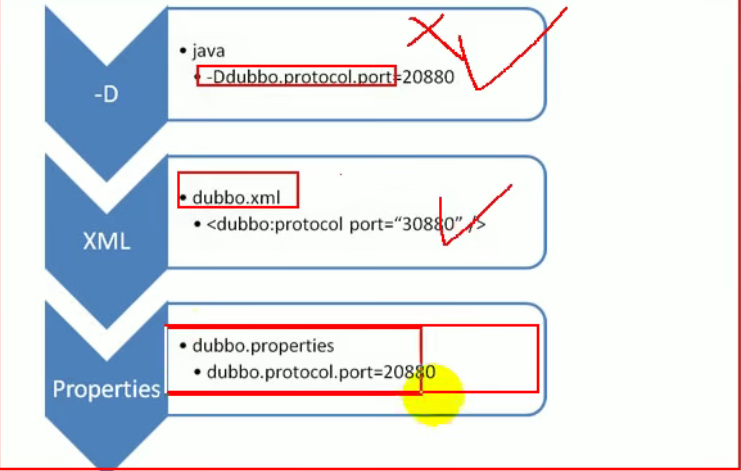

# dubbo

## 一、基础

### 1.1 dubbo.properties

#### 1.1.1 配置文件优先级



命令行->springXML配置->dubbo.properties

#### 1.1.2 配置生效规则

+ 默认1000ms
+ 超时属性配置优先规则
  + 精确优先  方法>服务>应用（全局配置）
  + 如果级别一样则 消费>生产

#### 1.1.3重试次数

+ 默认重试次数为3
+ 接口幂等性就是用户对同一操作发起了一次或多次请求的对数据的影响是一致不变的，不会因为多次的请求而产生副作用。

#### 1.1.4 使用version配置可以实现灰度发布

#### 1.1.5 本地存根

+ 可以使用本地存根进行一些提前的验证

```java

/**
 * 消费者端本地存根，使用有参构造器
 * @author lee
 */
public class UserServiceStub implements UserService {

    private UserService userService;

    public UserServiceStub(UserService userService) {
        this.userService = userService;
    }

    public String sayHello(String name) {
        if (name == null) {
            return "hello 无名";
        }

        return userService.sayHello(name);
    }

}


```

```xml
<dubbo:reference id="userService" check="false" interface="com.dubbo.service.UserService" stub="com.dubbo.consumer.stub.UserServiceStub"/>
```


#### 1.1.6 